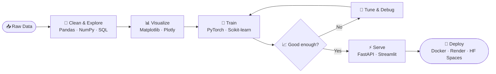

<!-- Profile README for Anushka-Gupte -->

<div align="center">


<a href="https://github.com/Anushka-Gupte">
  
</a>

</div>

---

## 🧠 `class Me(nn.Module)`

```python
import torch.nn as nn

class Me(nn.Module):
    def __init__(self):
        super().__init__()
        self.languages  = ["Python", "Java", "C", "C++", "SQL"]
        self.ml_stack   = ["PyTorch", "Scikit-learn", "LangChain"]
        self.data_stack = ["NumPy", "Pandas", "Matplotlib", "Plotly"]
        self.serving    = ["FastAPI", "Streamlit", "Docker"]
        self.fuel       = nn.Parameter(coffee)          # requires_grad=True

    def forward(self, idea):
        prototype = self.build(idea)
        model     = self.train(prototype)
        return self.deploy(model)                       # ship it 🚀
```

## 📉 `training.log`

```text
Epoch 1/∞  ── loss: 2.3104 ── curiosity: ↑↑↑
Epoch 2/∞  ── loss: 1.4820 ── bugs_fixed: 12
Epoch 3/∞  ── loss: 0.7391 ── side_projects: overfitting (ignoring regularization)
[ OK ] Checkpoint saved → /mnt/skills/next_level.pt
```

## 👾 `neofetch`

```text
Anushka-Gupte@github
--------------------
OS:         Human 2.0 (Computer Engineering build)
Languages:  Python, Java, C, C++, SQL
ML / AI:    PyTorch, Scikit-learn, Deep Learning, LangChain
Data:       NumPy, Pandas, Matplotlib, Plotly
Serving:    FastAPI, Streamlit, Docker
Cloud:      Render, Hugging Face Spaces, Vercel
Shell:      Git + GitHub
Shipped:    3 live ML/AI apps
Status:     Training something (probably a side project)
```

## 🚀 Featured Projects

### 🧠 Neural Network View
 
<div align="center">
  
</div>

## 🧰 Technical Skills

<div align="center">


</div>

<br>

| Category | Tools |
|:---------|:------|
| **Languages** |      |
| **Machine Learning & AI** |     |
| **Data Science & Analytics** |   |
| **Data Visualization** |    |
| **Web Development & APIs** |    |
| **Deployment & DevOps** |    |
| **Version Control** |   |
| **Also used in projects** |       |

## 🔄 My ML Pipeline



## 🔌 Datasheet: `ENG-2026` Pin Configuration

| Pin | Name | Function |
|:---:|:-----|:---------|
| 1 | `VCC` | Powered by coffee and curiosity |
| 2 | `GND` | Grounded in fundamentals: data structures, algorithms, systems |
| 3 | `CLK` | Ships something new every sprint |
| 4 | `RX` | Open to feedback, code reviews and collaboration |
| 5 | `TX` | Writes about what I learn and build |
| 6 | `INT` | Interrupt priority: bugs > features > sleep |
| 7 | `GPIO` | Currently exploring: **real-time ML apps & AI for fintech** |
| 8 | `NC` | No connection to boring, repetitive work |

## 📊 GitHub Stats
 
<div align="center">

<br><br>
 


 
<!--
  Stats + top-languages cards. To turn these on, deploy your own
  github-readme-stats on Vercel, replace YOUR_VERCEL_DOMAIN below,
  then delete this comment's opening and closing markers.


-->
 
</div>

## 🐍 Contribution Snake

<div align="center">
<picture>
  <source media="(prefers-color-scheme: dark)" srcset="https://raw.githubusercontent.com/Anushka-Gupte/Anushka-Gupte/output/github-snake-dark.svg" />
  <source media="(prefers-color-scheme: light)" srcset="https://raw.githubusercontent.com/Anushka-Gupte/Anushka-Gupte/output/github-snake.svg" />
  
</picture>
</div>

## 🥚 Easter Egg

Decode this to say hi back:

```text
01001000 01100101 01111001
```

## 📡 Signal Me

<div align="center">

[](https://www.linkedin.com/in/anushka-gupte-b322b3334)
[](anushka.gupte06@gmail.com)


</div>
